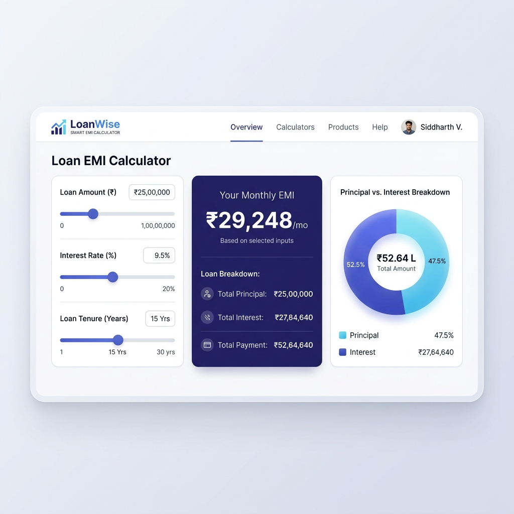
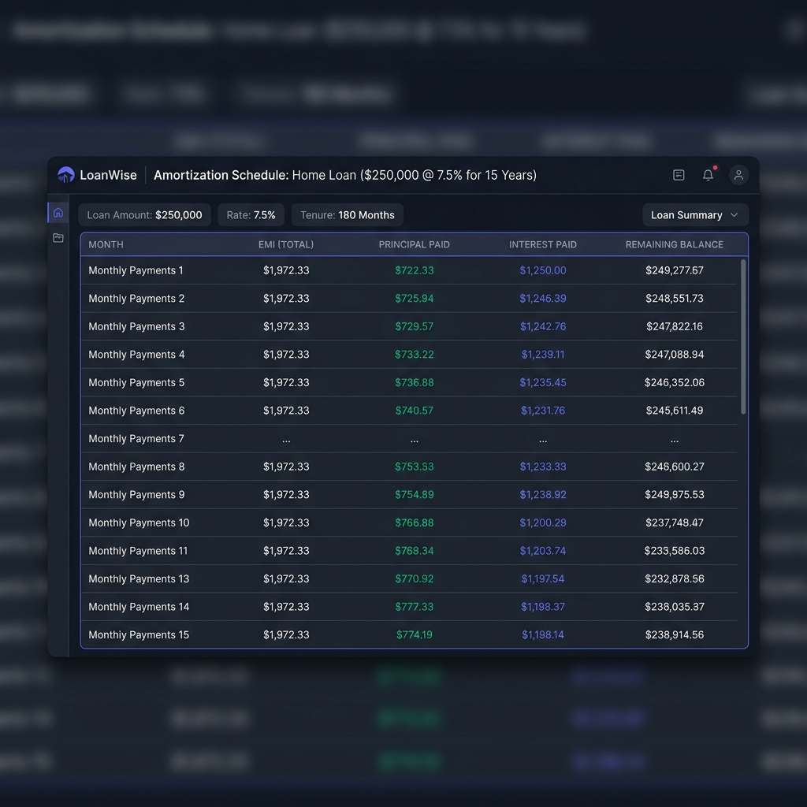

# LoanWise - EMI Calculator

**LoanWise** is a modern, production-ready fintech web application designed to help users calculate monthly Equated Monthly Installments (EMI), total interest payable, and total amount payable. It also generates a complete repayment amortization schedule and exports professional PDF statements on demand.

🚀 **Live Demo:** [https://loanwise-emi-calculator.vercel.app](https://loanwise-emi-calculator.vercel.app)

---

## Previews

### 1. LoanWise Financial Dashboard


### 2. Repayment Amortization Schedule


---

## Features

- **Standard EMI Calculation:** Computes accurate EMIs instantly using standard loan parameters:
  $$\text{EMI} = \frac{P \times r \times (1+r)^n}{(1+r)^n - 1}$$
- **Interactive Form Inputs:** Smooth sliders synced in real-time with numeric input boxes. Toggle tenure between years and months seamlessly.
- **Visual Analytics:** Beautiful pie charts built with Recharts displaying principal vs. interest breakdown.
- **Interactive Amortization Table:** Scrollable table showing Month, EMI, Principal Paid, Interest Paid, and Remaining Balance. Filter by specific month numbers instantly.
- **Professional PDF Export:** One-click download button generating clean, structured financial statements via jsPDF.
- **Dark & Light Themes:** Elegant dark mode support with localStorage persistence and an inline blocking script to prevent theme-flickering.
- **Copy & Share Tools:** Copy reports to clipboard in plain text or share using the Web Share API.
- **Animated Easing Counters:** Smooth, visual loading animation for calculated values.

---

## Tech Stack

- **Framework:** Next.js (latest App Router)
- **Language:** TypeScript (Strict Mode)
- **Styling:** Tailwind CSS (v4)
- **Libraries:**
  - `recharts` (Charts)
  - `jspdf` & `jspdf-autotable` (PDF Export)
  - `lucide-react` (Icons)
  - `canvas-confetti` (Celebration Effects)

---

## Local Development

Follow these steps to run the project locally:

1. **Clone the repository:**
   ```bash
   git clone https://github.com/akshanshvj/loanwise-emi-calculator.git
   cd loanwise-emi-calculator
   ```

2. **Install dependencies:**
   ```bash
   npm install
   ```

3. **Start the development server:**
   ```bash
   npm run dev
   ```
   Open [http://localhost:3000](http://localhost:3000) in your browser.

4. **Build for production:**
   ```bash
   npm run build
   ```

---

## Footer Details & Credits

Built by **Akshansh Vijay** ([akshanshvj4803@gmail.com](mailto:akshanshvj4803@gmail.com)).

[Built for Digital Heroes](https://digitalheroesco.com)
